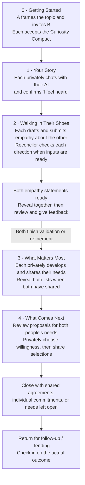
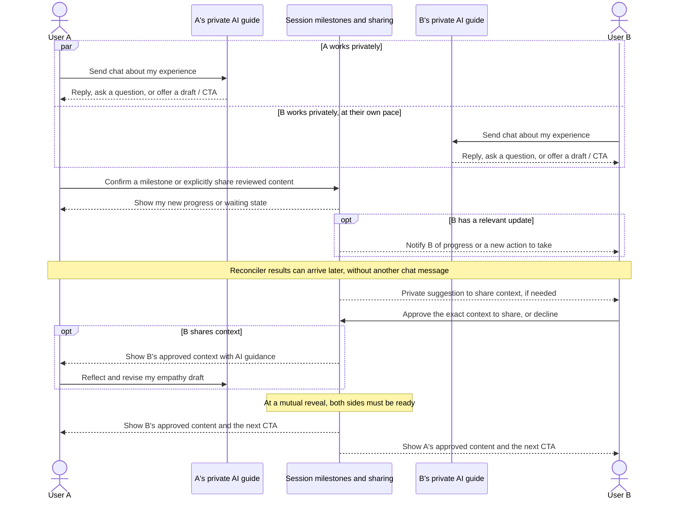
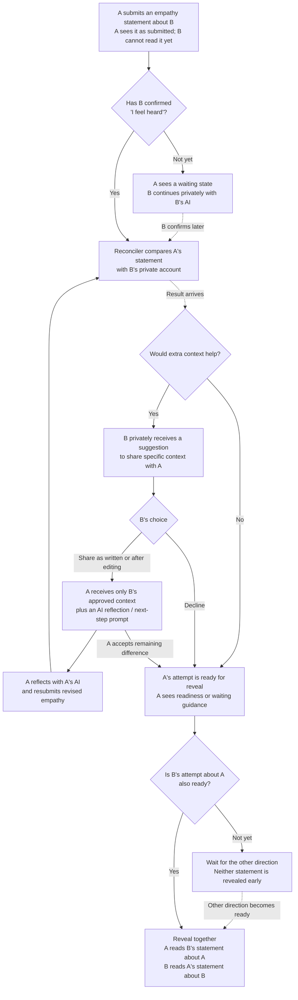

# Product Journey and Data Flow

This is a product map for the database and API redesign: what each person does, what data that creates, and who can see it when. **One session contains two private AI conversations and a few deliberate sharing points.** A and B can work at different speeds; they wait for each other only at the shared milestones below.

## The journey at a glance

A can start telling their story before B accepts the invitation. Each person enters empathy after confirming they feel heard, even if the other is still telling their story. Needs begin after both empathy directions finish validation; repair begins after both need lists are shared.

## Two private conversations, shared milestones

Each person repeats the same loop: **send a chat → receive AI guidance → review a draft or prompt → choose a CTA**. A CTA is an explicit action such as “I feel heard,” “Share,” “Revise,” or “Not quite yet.” Drafting something in chat does not by itself consent to sharing it.

The AI columns below represent each person's private experience. The session column represents the product's coordination of progress and approved content.

An AI response can stream or arrive later. Partner actions and background results can add a message, display a card, change a waiting state, or enable a CTA without the user sending anything else. If the user is away, a notification can bring them back; reopening the session shows the current permitted content even if an update was missed. These are product expectations; request timing and delivery transport are implementation choices.

## When the reconciler acts, and who sees its result

The reconciler compares **A's submitted understanding of B** with **B's private account of their experience**. It can use private material internally without exposing that material to the other person. Its analysis is not a shared chat transcript.

The diagram shows A trying to understand B. The same process runs separately with the roles reversed.

**After reveal:** each person reviews the statement about themselves. They can confirm it feels accurate or privately work with the Feedback Coach and explicitly send feedback to the statement's author. The author receives that feedback with AI guidance, then revises and resubmits for review or accepts the remaining difference. Both directions must finish this step before Stage 3. A reconciler readiness result does not mean the other person has validated the statement.

## What becomes visible, and when

“Private” below means hidden from the other participant; the relevant AI processing can still use that material within its permitted scope.

| Data or action | Who owns it / what it relates to | What the other person sees, and when |
|---|---|---|
| Invitation and confirmed topic frame | Inviter and session | Invitee sees the invitation details needed to decide whether to join; the framing conversation stays private. |
| Chat, AI replies, and working drafts | One participant's private conversation in this session | Private throughout, including after a stage ends. Only explicitly approved content crosses a sharing boundary. |
| Progress and readiness | One participant's progress in this session | Relevant joined, waiting, ready, or next-step status, subject to activity-visibility preferences; no private transcript. |
| Submitted empathy | One author, about the other participant | Held until both directional attempts are ready; both statements become visible together. Submission consent and actual reveal are distinct moments. |
| Reconciler analysis and share suggestion | A specific empathy attempt and direction | Internal analysis stays internal. The person being understood sees their own sharing suggestion; the author gets appropriate status or guidance. |
| Extra context | Person being understood → empathy author | Only the exact context approved by its owner, after they choose to share. Declining does not disclose the suggested text. |
| Validation feedback | Reviewer → author of a specific empathy attempt | Private while coached or drafted; delivered to the author after explicit send. |
| Needs | Each participant's own need list | Private during exploration and review. After both explicitly share, both lists appear side by side and Stage 4 opens. |
| Repair proposals | Proposal source (A, B, or AI), associated needs, and intended participants | Shared proposals can be reviewed during repair; private chat ideas are not automatically shared proposals. Individual commitments retain their owner. |
| Willingness selections | One participant's decision about a specific proposal | Partner choices stay hidden until both share selections. A shared agreement requires both people's willingness to that proposal. |
| Closure and follow-up | Session outcome, related agreements / commitments, and their participants | Show the actual outcome and applicable check-ins. Private follow-up belongs to the person opting in; no agreement is also a valid outcome. |

During repair, each person walks through their own and their partner's needs, reviews or refines proposals, and records willingness. They can leave a need open. Before closure, someone waiting on the partner can withdraw their selections to revise them. Closing without a shared agreement must preserve individual choices without creating an obligation for an absent or unwilling partner.

At any stage, a person can pause for emotional regulation and return to the same meaningful point in their journey.

## Relationships the redesign needs to preserve

- **Session and participant:** shared session membership does not grant access to the other person's private conversation. Progress belongs to each participant, while reveal milestones belong to the session.
- **Owner, subject, and recipient:** A can author empathy about B, B can share context back to A, and B can give feedback on A's attempt. These roles reverse for the other direction.
- **Draft, consent, and reveal:** retain which content was approved and when it became visible. A later private edit must not silently change what the partner was shown.
- **Result and source:** a reconciler result, sharing suggestion, or feedback response belongs to the relevant attempt and revision. A late result must not overwrite a newer decision or reopen completed work.
- **Proposal, choice, and outcome:** connect proposals to needs, choices to the participant making them, and agreements or individual commitments to the people who accepted them.
- **Recipient and current view:** a notification or asynchronous update exposes only what its recipient may see. Reopening the session must recover the same state without relying on having received every notification.

This map describes the intended product journey, not a fresh end-to-end validation of every path. Stage 4 and Tending remain evolving areas. Implementation detail lives in the [reconciler flow](../reconciler-flow.md) and [stage API documentation](../api/stages.md).
