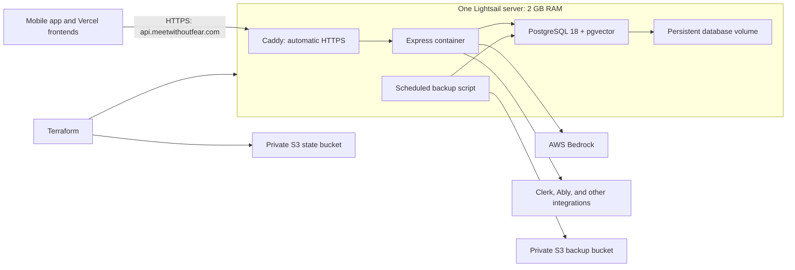

# AWS Lightsail migration plan

Status: **Completed on 2026-09-07, including web/native acceptance, deployment from main, and Render retirement. See [migration status](aws-migration-status.md) for final evidence and recovery details.**

Prepared: 2026-09-07.

## Decision and scope

Replace the Meet Without Fear Render API and PostgreSQL database with one AWS Lightsail Linux server in Oregon (`us-west-2`): 2 GB RAM, 60 GB disk, and an attached static IPv4 address. Run Express, PostgreSQL, and an HTTPS reverse proxy as separate Docker Compose services. Define AWS resources in Terraform and provide scripts for deployment, backup, and restoration.

This is a development/testing environment without real users. A planned outage is acceptable. The objective is a working app on its existing API hostname, a verified recovery procedure, and retirement of this project's Render resources.

This migration covers the API, its database, backups, and deployment automation. Existing Bedrock usage remains in the same AWS account. Vercel frontends, Clerk, Ably, Resend, and other integrations remain separate services. Other projects in the Render account are outside scope.

## Cost and operating tradeoffs

| Item | Estimated monthly cost |
| --- | ---: |
| Lightsail `small_3_0`, 2 GB RAM, 60 GB disk, public IPv4 | $12.00 |
| S3 database backups and Terraform state at current size | Less than $1 |
| Expected total before Bedrock, taxes, and exceptional usage | **About $12–13** |
| Current Render configuration: Starter API, Basic-256mb DB, 15 GB storage | **About $17.50** |

The Render figure is based on configured resources and published pricing, not an inspected invoice. AWS credits are not assumed. No RDS, NAT gateway, load balancer, or paid server snapshots are planned. The attached Lightsail static IP is included in the bundle. S3 usage grows with backup size and retention.

We maintain the server OS, Docker, PostgreSQL updates, and recovery procedure. Security updates, service restarts, HTTPS renewal, and nightly backups will be automated where practical. Major upgrades and reboots are deliberate maintenance operations. The app and database share one failure domain and memory pool. A total server failure requires restoring onto a replacement server; up to one backup interval of changes could be lost. No automatic failover or point-in-time database recovery is promised.

Sources: [Lightsail pricing](https://aws.amazon.com/lightsail/pricing/), [attached static IP pricing](https://docs.aws.amazon.com/lightsail/latest/userguide/understanding-static-ip-addresses-in-amazon-lightsail.html), [S3 pricing](https://aws.amazon.com/s3/pricing/), [Render pricing explanation](https://render.com/articles/how-much-does-cloud-application-hosting-cost-for-small-businesses).

## Existing system and migration baseline

Recheck these observations immediately before implementation:

- AWS account: `679575633563`; local administrative profile: `jason`.
- Render API: `meet-without-fear-api`, ID `srv-d58bj73uibrs73akacd0`.
- Render DB: `be-heard-db`, ID `dpg-d58660shg0os73bkkpmg-a`.
- API hostname: `api.meetwithoutfear.com`; DNS is managed at Namecheap.
- The user will change the DNS record after receiving the target address.
- Last inspected live Render commit: `2f18b0f2d0e51524de70a00531cd52b1c8a475b1`.
- Database: PostgreSQL 18.3, `pgvector` 0.8.1, approximately 18 MB, 9 users, and 1,042 messages. Counts are observations, not immutable acceptance values.
- Production settings come from Render's service settings and `be-heard-api-env` environment group. Local development environment files contain different settings and must not become production configuration.
- The existing `/health` endpoint reports process health; it does not verify a database connection.
- The original checkout contains unrelated uncommitted changes. Migration work is isolated in the `codex/aws-lightsail-migration` worktree. The initial deployment uses the actual live Render commit, not an arbitrary checkout or uncommitted changes.

Only standard PostgreSQL extensions were observed. Investigate compatibility issues found during restore rather than assuming proprietary Render objects need removal.

## Target layout



- Publish only HTTPS/HTTP and restricted administrative SSH. Do not publish PostgreSQL or the Express container port to the internet.
- Configure Caddy to preserve streaming responses and WebSocket upgrades; test both.
- Persist PostgreSQL data and Caddy's certificate state outside disposable container filesystems. Application deployment must not replace or delete database volumes.
- Use a non-superuser application database role. Keep database administration credentials separate from application credentials.
- Pin application and database image versions. Preserve PostgreSQL major version 18 and compatible `pgvector` support for the initial migration.
- Cap container logs, configure modest swap for transient memory pressure, and check memory/disk use under realistic tests. Prefer building release images in CI so TypeScript builds do not compete with production PostgreSQL for memory.
- Review reverse-proxy client-IP handling against Express rate limiting. Any necessary code change must be explicit and tested.

## Repository deliverables

Keep the deployment configuration in one small directory, with `main.tf` as the infrastructure entry point. Terraform defines resources; Compose defines software services; scripts define repeatable operations.

Proposed files:

```text
infra/aws/
  main.tf                 # Server, IP, firewall, buckets, IAM, outputs
  variables.tf            # Region, names, operator access, bundle size
  versions.tf             # Terraform/provider constraints and state backend
  terraform.tfvars.example
  bootstrap.sh            # Host setup and maintenance configuration
  compose.yaml            # API, PostgreSQL, HTTPS proxy, persistent volumes
  Caddyfile
  Dockerfile              # Reproducible backend release build
  backup.sh               # Database dump, checksum, S3 upload
  restore.sh              # Explicit target restore with validation
  deploy.sh               # Deploy one selected release and verify it
  README.md               # Setup, deploy, restore, upgrade, and rollback commands
.github/workflows/aws-deploy.yml
```

Add Terraform state, plan outputs, credentials, dumps, and local configuration to ignore rules before generating them. Commit the provider lockfile. Credentials must not be embedded in Terraform variables, user data, Git, build layers, or logged commands.

### Terraform state and protection

1. Bootstrap with protected local state to create the private S3 state bucket.
2. Enable bucket encryption, public-access blocking, versioning, and TLS-only access.
3. Migrate local Terraform state into that bucket and enable S3 state locking.
4. Validate a subsequent plan has no unexpected changes.
5. Use `prevent_destroy` on the instance and important storage resources. Document that intentionally removing those safeguards is an operator decision, and that Terraform alone does not preserve data if a server is replaced.

Keep backup and state buckets separate, with different retention policies. Preserve state history; expire database backup objects according to their intended retention.

### Credentials and deployment access

Lightsail instances do not provide the standard EC2 instance-role workflow. Use narrowly scoped runtime credentials where necessary. Preserve the production Bedrock configuration during migration; never place the local administrator credentials on the server.

Give the backup process permission to write only its designated S3 backup prefix, with no bucket-administration or deletion permission. Restore uses separate operator credentials. Keep production secrets in protected host files, supplied outside Terraform and Git. Back up the necessary configuration separately using operator credentials so a server rebuild can recover more than database data.

Use GitHub OIDC for AWS deployment permissions where applicable. Restrict SSH access and deploy permissions to the minimum needed. Finalize and test the CI transport during implementation; do not leave a publicly writable release endpoint or embed an administrator key in GitHub secrets.

## Backups and recovery

- Run `pg_dump` in custom format nightly using a PostgreSQL 18-compatible client. It produces a consistent database snapshot while the app is running.
- Take an additional backup before database migrations and before cutover.
- Create a local temporary file, check command success and archive readability, calculate a checksum, then upload with a unique timestamped key. Do not mark a backup successful before upload completes.
- Keep seven days of nightly backups and 30 days of pre-migration/final Render backups using separate prefixes and S3 lifecycle rules. If versioning is enabled for backups, expire noncurrent versions too.
- Record the database version, app release, migration state, timestamp, and checksum alongside each backup without recording secrets.
- Use a systemd timer with missed-run recovery and a lock to avoid overlapping backups. Keep a last-success record and clear failure logs; check backup freshness as part of operational health checks.
- Keep local temporary backups bounded. Automatic restart is appropriate for the app; avoid endless destructive database recovery loops.
- Restore into a separate temporary database before declaring backups usable. Verify schema, migration history, row counts, foreign keys, and representative application reads. Archive listing alone is not a restore test.
- Document recovery onto a new Lightsail instance, including configuration restoration, database import, and static-IP reassignment. Measure the first restore duration rather than promise an untested recovery time.

## Execution phases

### 1. Prepare and review

- Reconfirm AWS identity, current Render release, production environment settings, database extensions and roles, DNS record, and all production database clients.
- Include the status dashboard, diagnostic scripts, and any bot or readonly access in the database-client inventory. Recreate required roles explicitly; do not migrate Render-managed administrative roles blindly.
- Create the infrastructure, container, backup, restore, and deployment files.
- Run formatting, Terraform validation and plan, shell validation, and container configuration checks. Check that secrets are excluded from source and image build context.
- Inspect the plan to ensure it provisions only the agreed resources and $12 Lightsail bundle.

### 2. Provision and rehearse

- Provision AWS resources and migrate Terraform state into S3.
- Bootstrap the host, install containers and scheduled maintenance, and securely populate production configuration.
- Build and deploy the live Render code version against a restored rehearsal database.
- Keep public production DNS pointing to Render during rehearsal. Use an SSH tunnel or controlled preview access for verification.
- Test database access, Prisma migrations, authentication enforcement, real Bedrock calls, streaming, and realtime integration. Ensure production auth bypass and mock-AI modes are disabled.
- Verify the nightly backup command and restore its S3 artifact into a disposable database.
- Test restarting the host: services should recover, database data should persist, and backup scheduling should remain installed.

### 3. Freeze writes and make the final copy

- Disable Render deployment triggers and stop all identified production database writers, including the Render API and any background writers. A DNS change alone does not freeze writes.
- Export a final consistent Render backup and preserve it in S3. Record table counts and migration history while writes are stopped.
- Replace only the AWS rehearsal database with the final production copy. Restore roles and privileges intentionally, then compare the final source and target data.
- Keep migrations aligned with the selected application release and verify encryption settings/keys are preserved when present.
- Start the AWS app against the final database. Render remains stopped so clients with cached DNS cannot write to the old copy.

### 4. DNS cutover and application acceptance

- Give the user the static IP and exact Namecheap change: replace the `api` CNAME with the required A record, preserving unrelated records. Check for conflicting AAAA records.
- The user changes DNS. Check authoritative DNS and propagation, obtain/verify the HTTPS certificate, and test the normal API hostname.
- Confirm the deployed web and mobile clients can authenticate, load existing sessions, create test content, receive a real AI response, and persist it across reloads.
- Test SSE and WebSocket behavior, Ably updates with test accounts, and relevant external service configuration. Any outbound email or notification test uses an explicitly approved recipient.
- Confirm unauthorized requests remain rejected and PostgreSQL is not publicly reachable.
- Check memory, disk, logs, restart behavior, and backup freshness.

### 5. Switch ongoing deployment and retire Render

- Replace the Render deploy workflow with the verified AWS workflow. Preserve the existing policy that backend-relevant changes trigger backend deployments.
- Each deployment records the exact release, backs up before migrations, runs migrations, checks health and database connectivity, and reports failures. Preserve the previous app image for rollback; do not imply an app rollback reverses a database migration.
- Update production database consumers and local production-query configuration. Use SSH tunneling for administrative database access.
- Update living deployment docs and canonical infrastructure references to match the deployed system.
- After acceptance passes, remove only the Meet Without Fear Render API and database. Keep the final backup for its stated retention window.
- Remove obsolete deployment hooks and migration-only credentials, review reused credentials, and verify no remaining dependency on the retired Render hostname or database.
- Confirm Render resource retirement and record final AWS resource IDs, endpoint, deployed commit, backup location, and estimated recurring cost.

## Rollback

The following describes the migration window. Render resources were retired after acceptance; recovery now uses AWS/S3 backups.

- Before AWS receives writes: resume the unchanged Render service and restore the previous DNS record if needed.
- After AWS receives writes: freeze AWS writes and copy the latest data back to Render before routing clients there, or repair AWS in place. Switching DNS back to an outdated Render database would lose new changes.
- Retain the original Render resources until application acceptance succeeds. Deleting Render ends the immediate rollback option; recovery then uses AWS backups and reproducible infrastructure.
- Reconcile database schema compatibility before any application-version rollback. Never automatically run destructive down-migrations.

## Completion criteria

- [x] Terraform owns the agreed resources, state is recoverable in S3, and a clean plan shows no unexplained drift.
- [x] The normal HTTPS API hostname serves AWS and existing app clients function.
- [x] Final source/target database checks agree, including migration state and required roles.
- [x] Authentication, real Bedrock responses, persistence, streaming, and realtime behavior pass.
- [x] Production bypass/mock settings are disabled and database ports are private.
- [x] An S3 backup has been restored successfully and nightly backup scheduling is installed.
- [x] A host restart preserves data and restores services.
- [x] Ongoing deployment and production database consumers use AWS.
- [x] The user has a concise deployment/recovery runbook.
- [x] This project's Render API and database are retired; unrelated Render services are untouched.

## Later move to RDS

Keep PostgreSQL standard and the connection URL configurable. A future move to RDS consists of provisioning a compatible instance and private connectivity, freezing writes, dumping/restoring the database, changing the connection setting, and testing the app. It remains a data migration with downtime, but does not require redesigning the application.
