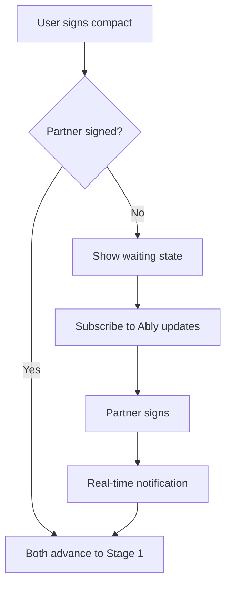

# Stage 0 API: Onboarding

Endpoints for the Curiosity Compact signing flow.

## Sign Curiosity Compact

Sign the Curiosity Compact to commit to the process.

```
POST /api/v1/sessions/:id/compact/sign
```

### Request Body

```typescript
interface SignCompactRequest {
  // No body required - signing is implicit
}
```

### Response

```typescript
interface SignCompactResponse {
  signed: boolean;
  signedAt: string;
  partnerSigned: boolean;
  canAdvance: boolean;
}
```

### Example

```bash
curl -X POST /api/v1/sessions/sess_abc123/compact/sign \
  -H "Authorization: Bearer <token>"
```

```json
{
  "success": true,
  "data": {
    "signed": true,
    "signedAt": "2024-01-16T14:30:00Z",
    "partnerSigned": false,
    "canAdvance": false
  }
}
```

### Side Effects

1. Updates `StageProgress.gatesSatisfied` with `compactSigned: true`
2. If partner already signed, both users can advance
3. Partner receives notification that user signed

### Errors

| Code | When |
|------|------|
| `CONFLICT` | User already signed |
| `SESSION_NOT_ACTIVE` | Session not in ACTIVE status |

---

## Get Compact Status

Check compact signing status for both parties.

```
GET /api/v1/sessions/:id/compact/status
```

### Response

```typescript
interface CompactStatusResponse {
  mySigned: boolean;
  mySignedAt: string | null;
  partnerSigned: boolean;
  partnerSignedAt: string | null;  // Only visible after user signs
  canAdvance: boolean;
}
```

### Privacy Note

`partnerSignedAt` is only returned if the current user has signed. This prevents one party from waiting to see if the other signs first.

### Example Response (user signed, partner hasn't)

```json
{
  "success": true,
  "data": {
    "mySigned": true,
    "mySignedAt": "2024-01-16T14:30:00Z",
    "partnerSigned": false,
    "partnerSignedAt": null,
    "canAdvance": false
  }
}
```

### Example Response (both signed)

```json
{
  "success": true,
  "data": {
    "mySigned": true,
    "mySignedAt": "2024-01-16T14:30:00Z",
    "partnerSigned": true,
    "partnerSignedAt": "2024-01-16T14:45:00Z",
    "canAdvance": true
  }
}
```

---

## Stage 0 Gate Requirements

To advance from Stage 0 to Stage 1:

| Gate | Requirement |
|------|-------------|
| `compactSigned` | User has signed the compact |
| `partnerCompactSigned` | Partner has signed the compact |

**Both** users must sign before **either** can advance.

---

## Compact Content

The Curiosity Compact text is served as static content, not via API. It should be embedded in the mobile app.

See [Stage 0: Onboarding](../../stages/stage-0-onboarding.md#the-curiosity-compact) for the full text.

---

## Waiting State

When user has signed but partner hasn't:

1. Show waiting UI with partner status
2. Subscribe to Ably channel for real-time update
3. Optionally allow user to "nudge" partner (separate endpoint, rate limited)



---

## Related Documentation

- [Stage 0: Onboarding](../../stages/stage-0-onboarding.md) - Full stage documentation
- [Stages API](./stages.md) - Stage advancement
- [Real-time Integration](./realtime.md) - Ably notifications

---

[Back to API Index](./index.md) | [Back to Backend](../index.md)
