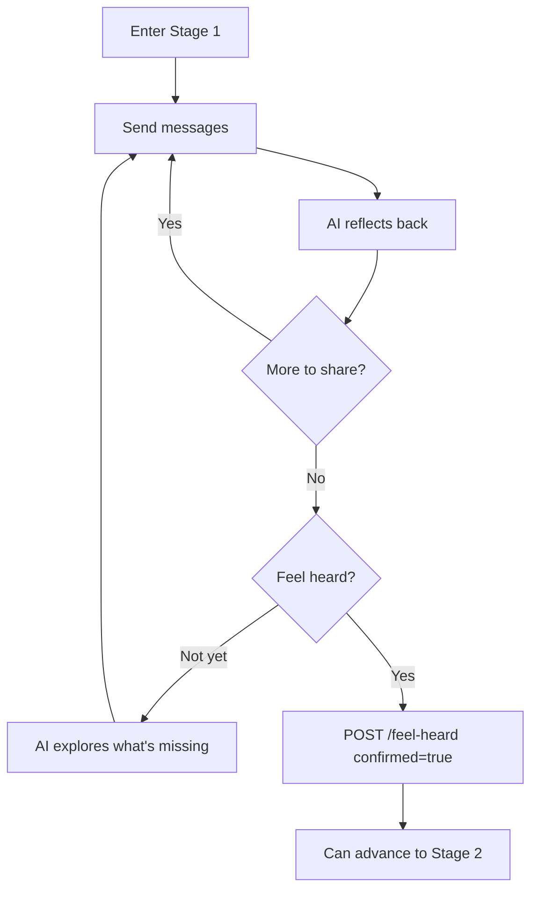

# Stage 1 API: The Witness

Endpoints for the witness stage - being heard by the AI.

## Send Message

Send a message in the conversation. Works for all stages but has stage-specific AI behavior.

```
POST /api/v1/sessions/:id/messages
```

### Request Body

```typescript
interface SendMessageRequest {
  content: string;

  // Optional: include emotional reading with message
  emotionalIntensity?: number;  // 1-10
  emotionalContext?: string;
}
```

### Response

```typescript
interface SendMessageResponse {
  userMessage: MessageDTO;
  aiResponse: MessageDTO;

  // If emotional intensity is high
  suggestPause?: boolean;
  pauseReason?: string;
}
```

### Example

```bash
curl -X POST /api/v1/sessions/sess_abc123/messages \
  -H "Authorization: Bearer <token>" \
  -d '{
    "content": "I just feel like they never listen to what I need.",
    "emotionalIntensity": 6
  }'
```

```json
{
  "success": true,
  "data": {
    "userMessage": {
      "id": "msg_001",
      "sessionId": "sess_abc123",
      "senderId": "user_456",
      "role": "USER",
      "content": "I just feel like they never listen to what I need.",
      "stage": 1,
      "timestamp": "2024-01-16T15:30:00Z",
      "emotionalReading": {
        "id": "emo_001",
        "intensity": 6,
        "context": null,
        "stage": 1,
        "timestamp": "2024-01-16T15:30:00Z"
      }
    },
    "aiResponse": {
      "id": "msg_002",
      "sessionId": "sess_abc123",
      "senderId": null,
      "role": "AI",
      "content": "I hear that - feeling unheard is really painful. When you say they don't listen, what does that look like? Is it that they interrupt, or dismiss what you're saying, or something else?",
      "stage": 1,
      "timestamp": "2024-01-16T15:30:01Z"
    }
  }
}
```

### Stage 1 AI Behavior

In Stage 1, the AI:
- Reflects back what the user shares with empathy
- Uses paraphrase, emotion naming, and validation techniques
- Does NOT retrieve any partner data (Retrieval Contract enforced)
- May access user's own prior session content for continuity
- Focuses on helping user feel heard, not on solutions

### Side Effects

1. Message stored in `Message` table
2. UserEvent potentially created (for significant emotional content)
3. EmotionalReading stored if intensity provided
4. Embeddings generated asynchronously for semantic search

---

## Get Messages

Get message history for a session.

```
GET /api/v1/sessions/:id/messages
```

### Query Parameters

| Param | Type | Default | Description |
|-------|------|---------|-------------|
| `stage` | number | all | Filter by stage |
| `cursor` | string | - | Pagination cursor |
| `limit` | number | 50 | Max results (1-100) |

### Response

```typescript
interface GetMessagesResponse {
  messages: MessageDTO[];
  cursor?: string;
  hasMore: boolean;
}
```

---

## Confirm Feel Heard

Confirm that the user feels fully heard (Stage 1 gate requirement).

```
POST /api/v1/sessions/:id/feel-heard
```

### Request Body

```typescript
interface ConfirmFeelHeardRequest {
  confirmed: boolean;  // true = "I feel heard", false = "not yet"
}
```

### Response

```typescript
interface ConfirmFeelHeardResponse {
  confirmed: boolean;
  confirmedAt: string | null;
  canAdvance: boolean;
  partnerCompleted: boolean;
}
```

### Example: Confirming

```bash
curl -X POST /api/v1/sessions/sess_abc123/feel-heard \
  -H "Authorization: Bearer <token>" \
  -d '{"confirmed": true}'
```

```json
{
  "success": true,
  "data": {
    "confirmed": true,
    "confirmedAt": "2024-01-16T16:00:00Z",
    "canAdvance": true,
    "partnerCompleted": false
  }
}
```

### Example: Not Yet

```json
{
  "success": true,
  "data": {
    "confirmed": false,
    "confirmedAt": null,
    "canAdvance": false,
    "partnerCompleted": false
  }
}
```

### UI Integration

When `confirmed: false`, the AI should:
1. Acknowledge the user isn't ready
2. Explore what's missing
3. Continue the witnessing process

```
AI: "I hear that you're not quite feeling fully heard yet.
     What feels like it's missing? Is there something specific
     you haven't had space to express?"
```

---

## Stage 1 Gate Requirements

To advance from Stage 1 to Stage 2:

| Gate | Requirement |
|------|-------------|
| `feelHeardConfirmed` | User explicitly confirms feeling heard |

**Note**: Partner does NOT need to complete Stage 1 for user to advance. Stages 1-3 are parallel.

---

## Stage 1 Flow



---

## Retrieval Contract

In Stage 1, the API enforces these retrieval rules:

| Allowed | Forbidden |
|---------|-----------|
| User's own messages | Partner's data of any kind |
| User's emotional readings | Shared Vessel content |
| User's prior session content (same relationship) | AI Synthesis Map |

See [Retrieval Contracts: Stage 1](../state-machine/retrieval-contracts.md#stage-1-the-witness).

---

## Related Documentation

- [Stage 1: The Witness](../../stages/stage-1-witness.md) - Full stage documentation
- [Emotional Barometer API](./emotional-barometer.md) - Emotion tracking
- [Chat Interface Wireframe](../../wireframes/chat-interface.md) - UI design

---

[Back to API Index](./index.md) | [Back to Backend](../index.md)
