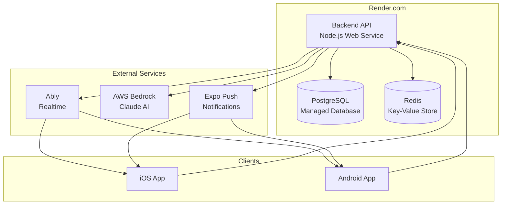

# Deployment Architecture

BeHeard deployment configuration for Render.com infrastructure.

## Documentation

### [Render Configuration](./render-config.md)
Service definitions, environment variables, and infrastructure setup.

### [Environment Variables](./environment-variables.md)
All required environment variables by service.

### [Push Notifications](./push-notifications.md)
Expo Push Notification setup for mobile.

## Infrastructure Overview

## Services

| Service | Type | Purpose |
|---------|------|---------|
| Backend API | Web Service | Express API server |
| PostgreSQL | Managed Database | Primary data store + pgvector |
| Redis | Key-Value Store | Session cache, rate limiting |

## Cost Estimate (MVP)

| Service | Tier | Monthly Cost |
|---------|------|--------------|
| Backend API | Starter | $7 |
| PostgreSQL | Starter | $7 |
| Redis | Free | $0 |
| Ably | Free tier | $0 (up to 6M messages) |
| AWS Bedrock | Pay per use | ~$50-100 (depends on usage) |
| Expo Push | Free | $0 |
| **Total** | | **~$64-114/mo** |

---

[Back to Plans](../index.md)
