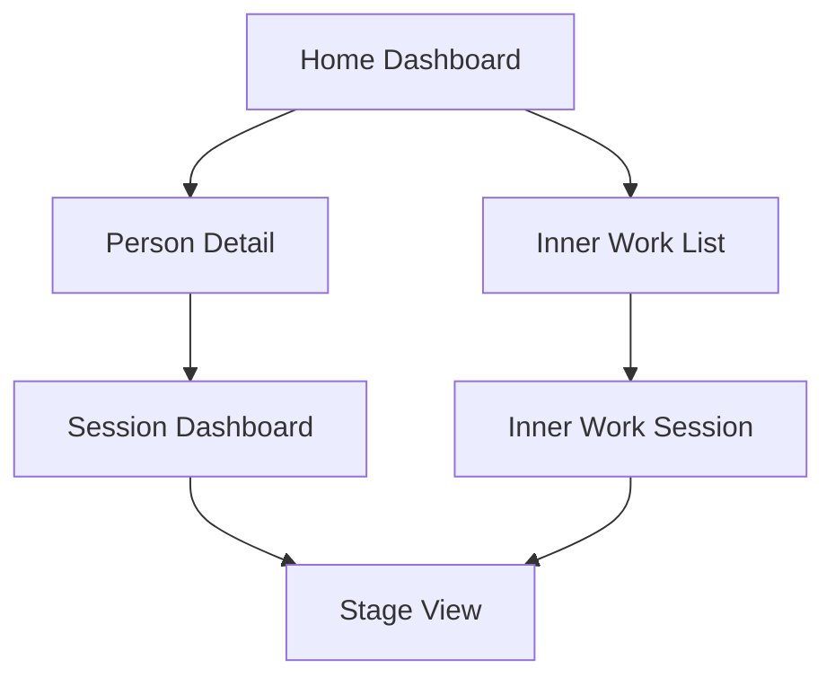
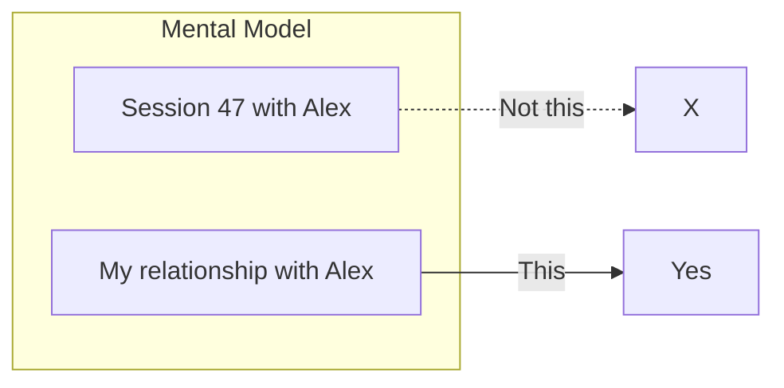
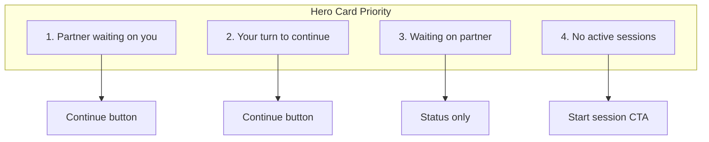
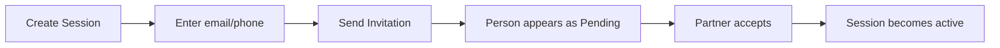
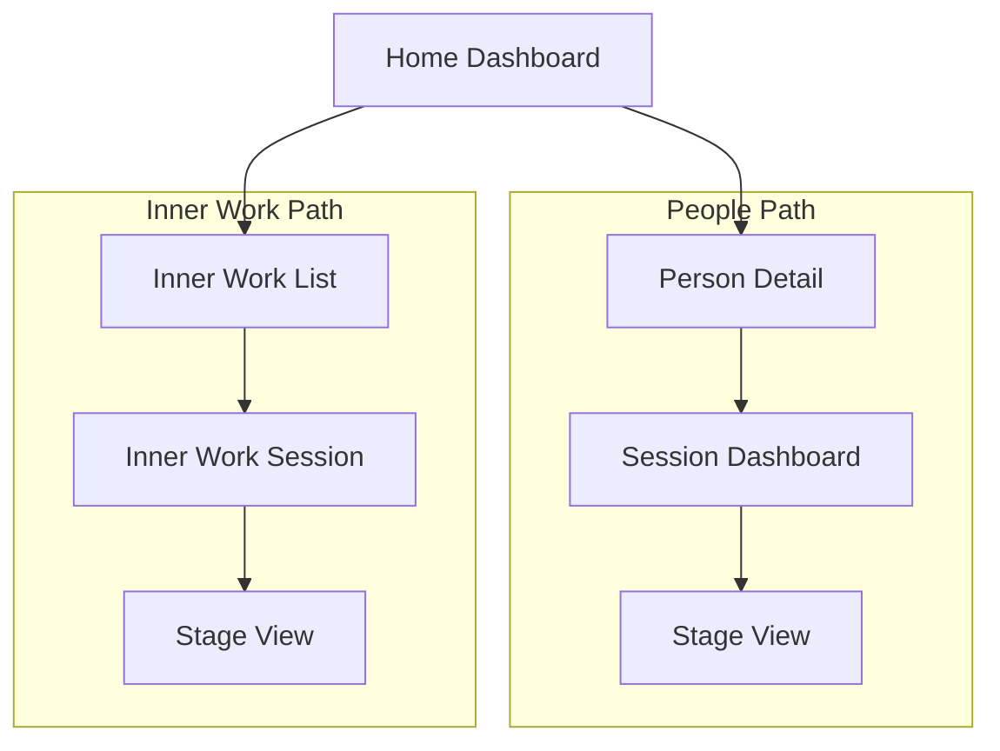

# Information Architecture

The navigation structure for BeHeard follows a **People-first** model. Users navigate through relationships, not transactions.

## Navigation Hierarchy

## Screen Inventory

| Screen | Purpose | Entry Points |
|--------|---------|--------------|
| Home Dashboard | Primary landing, shows all people and inner work | App launch, back navigation |
| Person Detail | Relationship view with current and past sessions | Tap person from Home |
| Session Dashboard | Preparation space before entering stage work | Tap session from Person Detail |
| Stage View | Active conversation interface | Continue from Session Dashboard |
| Inner Work List | Solo processing sessions | Tap Inner Work section on Home |
| New Session | Create session and invite someone | [+New] button, Start New Session |

## Core Principles

### Single Active Session

Each relationship can have only one active session at a time. This keeps focus on resolving one conflict before starting another. Completed sessions are archived under the person.

### People-First Navigation

Users think in terms of relationships, not session IDs. The app reinforces this by organizing everything under people.

### Smart Hero Card

The Home Dashboard features a prominent hero card that surfaces the most important action:

### Session-First Invitations

New people enter your People list through session creation, not contact management:

## Navigation Patterns

### Back Navigation

Back navigation follows the hierarchy strictly:
- Stage View → Session Dashboard
- Session Dashboard → Person Detail
- Person Detail → Home Dashboard

### Deep Links

Notifications can deep link directly to relevant screens:
- "Alex is waiting" → Session Dashboard with Alex
- "Partner accepted invite" → Person Detail

### Parallel Paths

People sessions and Inner Work are parallel paths from Home:

## Relationship Labels

The app uses neutral language for relationships:
- "Connected since Oct 2024" (not "Partner since")
- No relationship type labels (family, friend, etc.)
- Focus on the work, not categorizing relationships

---

[Back to Overview](./index.md) | [Home Dashboard Wireframe](../wireframes/home-dashboard.md)
