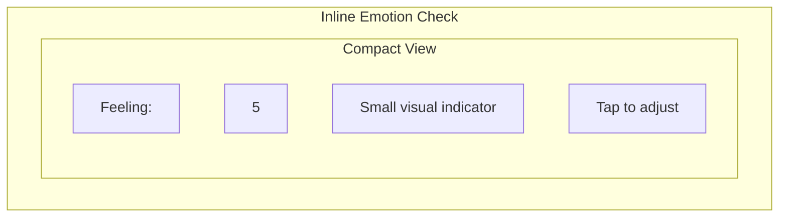
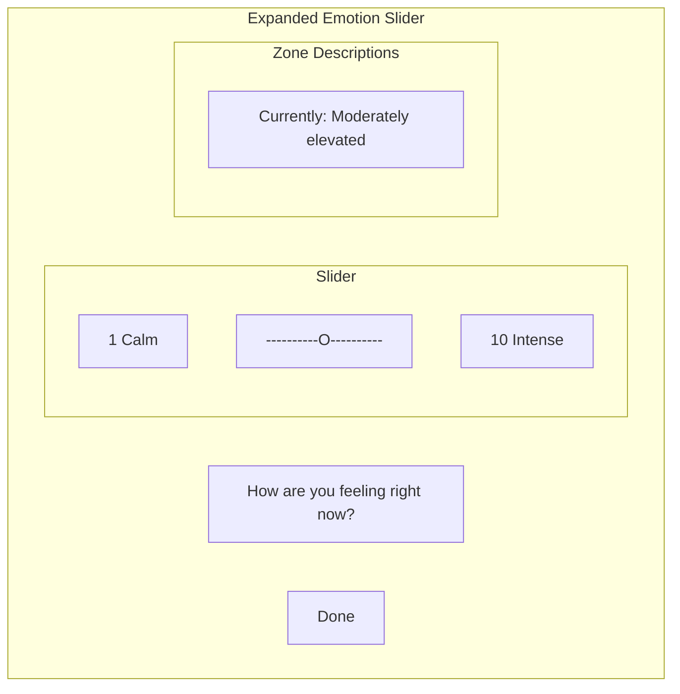
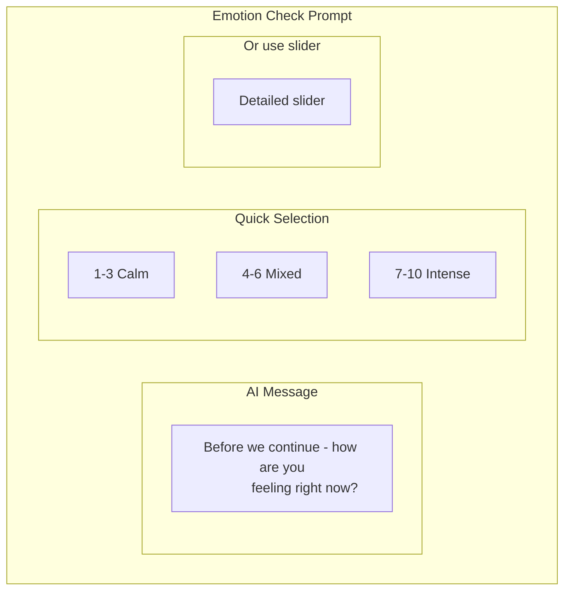
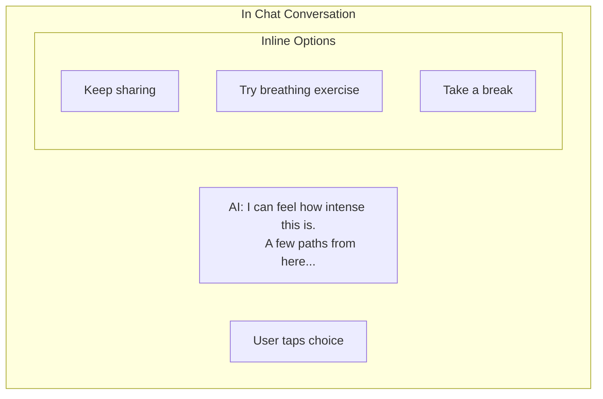
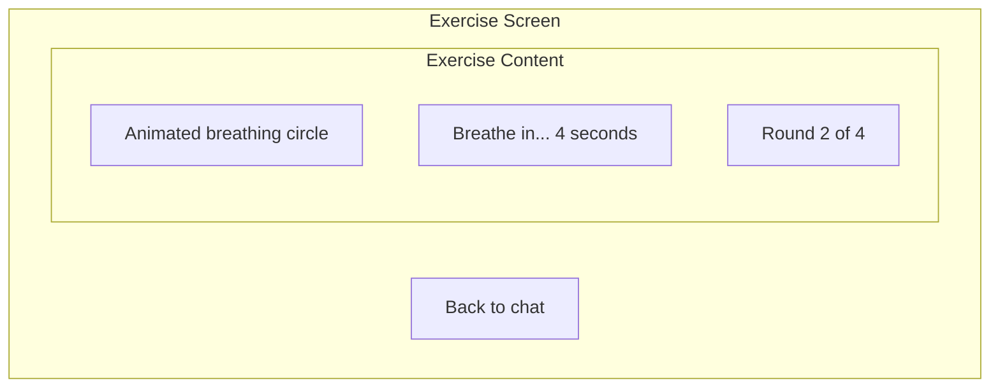
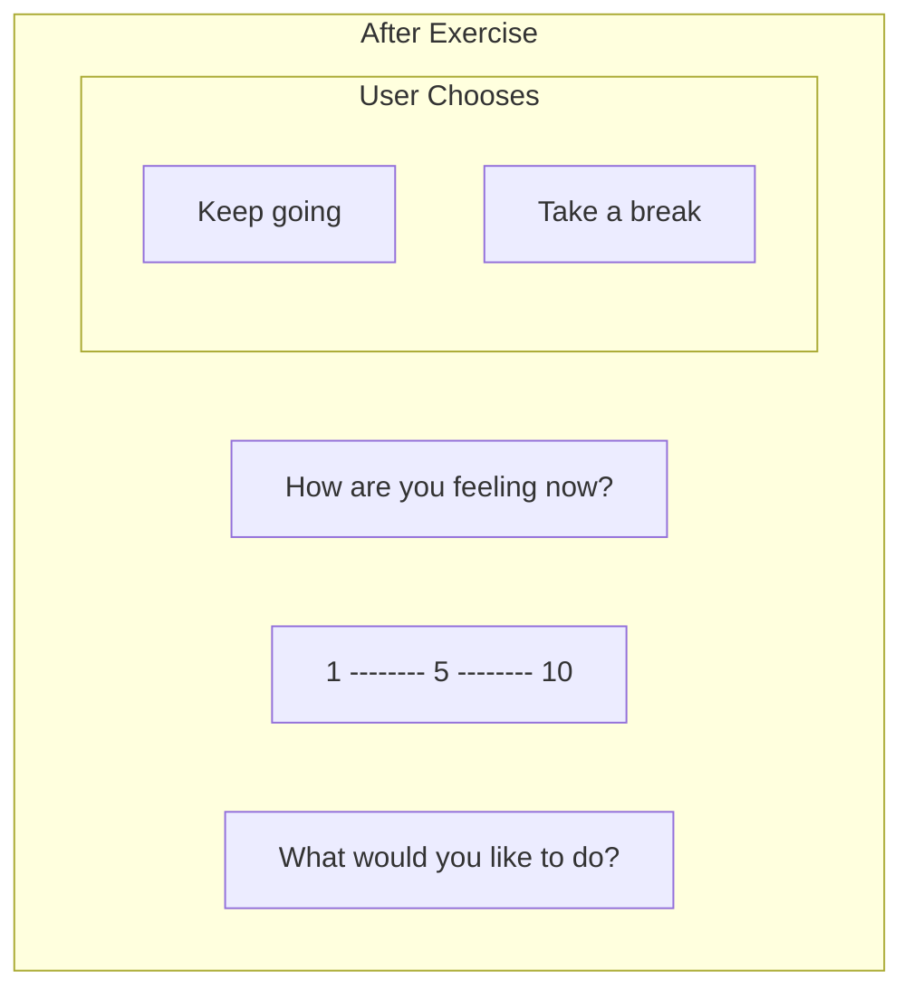
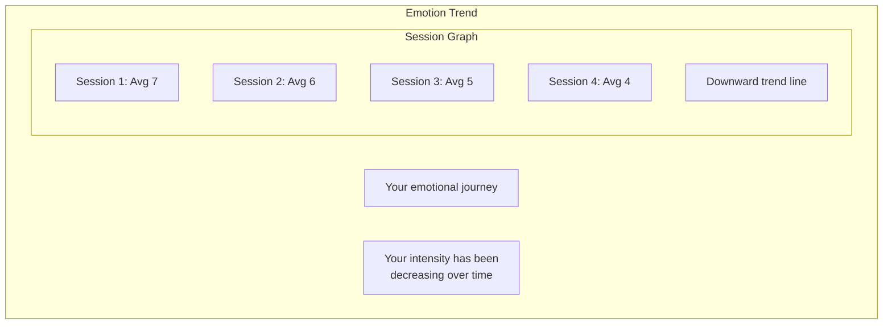
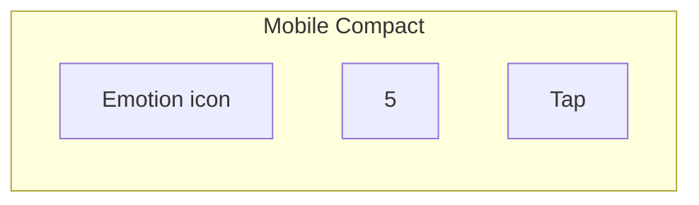
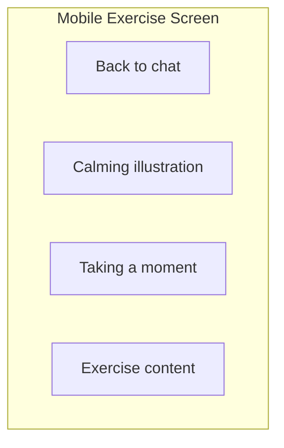

# Emotional Barometer UI

Interface components for tracking and responding to emotional intensity.

## Inline Check (Always Visible)

A minimal, always-present indicator in the input area:

This appears in the input bar and can be tapped to expand.

## Expanded Slider

## Zone Styling

| Range | Color | Description |
|-------|-------|-------------|
| 1-4 | Calm blue/green | Calm and regulated |
| 5-7 | Warm yellow | Elevated but manageable |
| 8-10 | Soft coral | High intensity |

## Periodic Prompt

The AI occasionally prompts for an emotion check:

## Support Options (Conversational)

When intensity is high, the AI offers options within the chat—no modal or separate screen:

If user chooses an exercise, it navigates to a dedicated exercise screen with a "Back to chat" option.

### Exercise Screen

When user chooses an exercise, the chat is saved and the exercise appears:

Animation sequence:
1. Circle expands: "Breathe in" (4 seconds)
2. Circle holds: "Hold" (7 seconds)
3. Circle contracts: "Breathe out" (8 seconds)
4. Repeat 4 times

### Post-Exercise Check-in

After the exercise, check in and offer choice (still in overlay):

No gatekeeping—user chooses their next step regardless of intensity rating. Overlay disappears when they choose, returning them to the chat.

## Trend Visualization (Optional)

For multi-session users, show emotional trends:

## Continuing to Share (No Separate Journal)

The "keep sharing" option means the user continues in the existing chat conversation. This serves the same cathartic purpose as private journaling—they're already writing in a private space with the AI.

If they choose to keep sharing:
- Overlay never appears
- AI continues witnessing and reflecting
- No interruption to their flow
- AI may gently check in on intensity later

## Mobile Adaptations

### Compact Mobile Emotion Check

### Mobile Exercise Screen

On mobile, the exercise screen includes a back button for easy return:

## Accessibility Considerations

| Feature | Implementation |
|---------|---------------|
| Color-blind friendly | Icons and labels, not just color |
| Screen reader | Descriptive labels for all states |
| Keyboard navigation | Full keyboard control of slider |
| Reduced motion | Option to disable animations |
| High contrast | Sufficient contrast in all states |

---

## Related Documents

- [Emotional Barometer Mechanism](../mechanisms/emotional-barometer.md)
- [Chat Interface](./chat-interface.md)
- [Core Layout](./core-layout.md)

---

[Back to Wireframes](./index.md) | [Back to Plans](../index.md)
