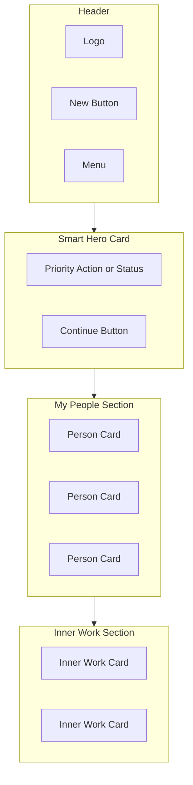
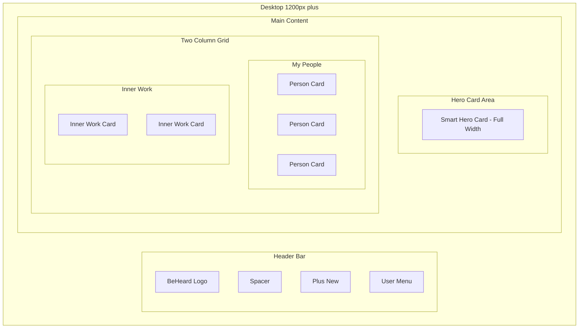
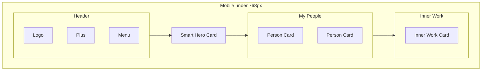
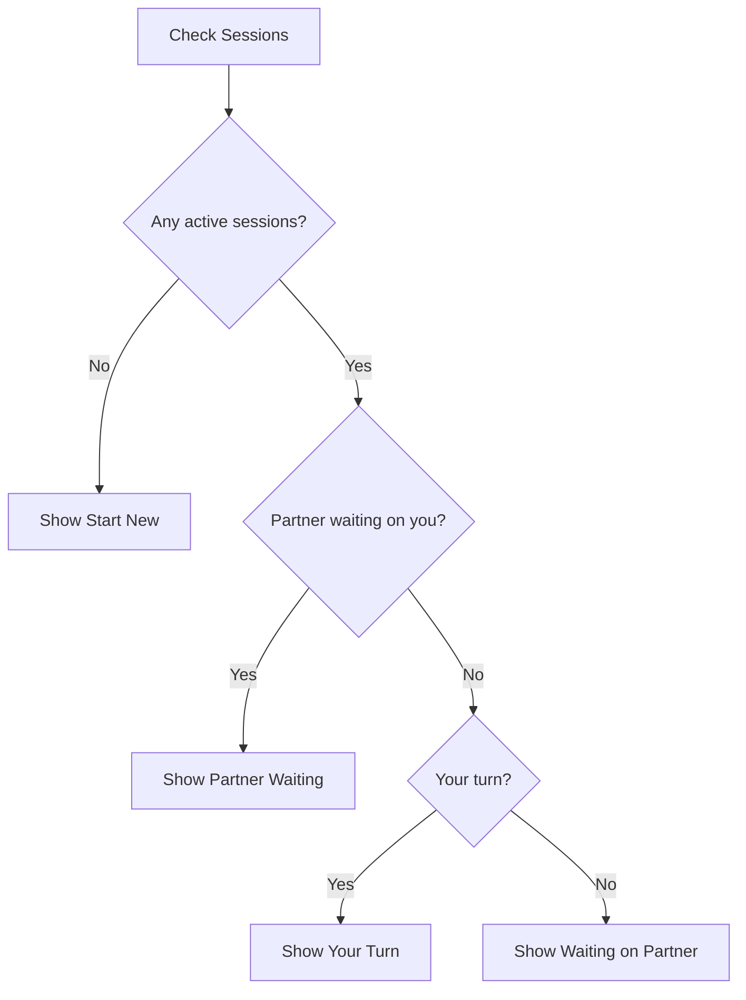
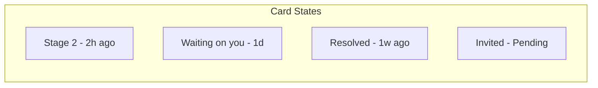

# Home Dashboard

The primary landing screen when users open BeHeard. Surfaces the most important action and provides access to all relationships and inner work.

## Layout Structure

## Desktop Layout

## Mobile Layout

## Smart Hero Card States

The hero card shows the single most important action or status.

### State 1: Partner Waiting on You

Highest priority. Partner has completed their turn and is waiting.

| Element | Content |
|---------|---------|
| Icon | Notification indicator |
| Title | Alex is waiting for you |
| Subtitle | Stage 2: Perspective Stretch |
| CTA | Continue (primary button) |

### State 2: Your Turn to Continue

You have work to do but partner is not actively waiting.

| Element | Content |
|---------|---------|
| Icon | Arrow indicator |
| Title | Ready to continue with Alex |
| Subtitle | Stage 1: The Witness |
| CTA | Continue (primary button) |

### State 3: Waiting on Partner

You have completed your turn. No action needed.

| Element | Content |
|---------|---------|
| Icon | Clock indicator |
| Title | Waiting for Alex |
| Subtitle | They are working on Stage 2 |
| CTA | None - status only |

### State 4: No Active Sessions

New user or all sessions resolved.

| Element | Content |
|---------|---------|
| Icon | Welcome or plus indicator |
| Title | Start your first session OR Ready to start something new |
| Subtitle | Invite someone to work through a conflict together |
| CTA | Invite Someone (primary button) |

### Hero Card Priority Logic

## Person Card

Each person in the My People list shows:

| Element | Description |
|---------|-------------|
| Avatar | Profile image or initials |
| Name | Person name |
| Status | Current stage OR Resolved OR Invited |
| Time | Time since last activity |
| Indicator | Dot if waiting on you |

### Person Card States

## Inner Work Card

Each inner work session shows:

| Element | Description |
|---------|-------------|
| Topic | Brief description |
| Status | In progress OR Completed |
| Time | Time since last activity |

## Empty States

### No People Yet

When user has no sessions:
- Friendly illustration
- "No sessions yet"
- "Start by inviting someone to work through something together"
- Invite Someone button

### No Inner Work

When user has no inner work sessions:
- "Process something on your own"
- Start Inner Work button

## Actions

| Action | Result |
|--------|--------|
| Tap Plus New | Open New Session flow |
| Tap Hero CTA | Go to Session Dashboard |
| Tap Person Card | Go to Person Detail |
| Tap Inner Work Card | Go to Inner Work Session |
| Tap Menu | Open user menu |

---

[Back to Wireframes](./index.md) | [Person Detail](./person-detail.md) | [Information Architecture](../overview/information-architecture.md)
