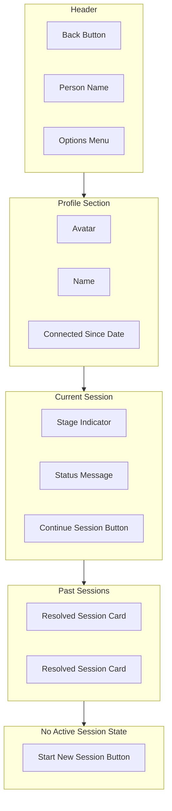
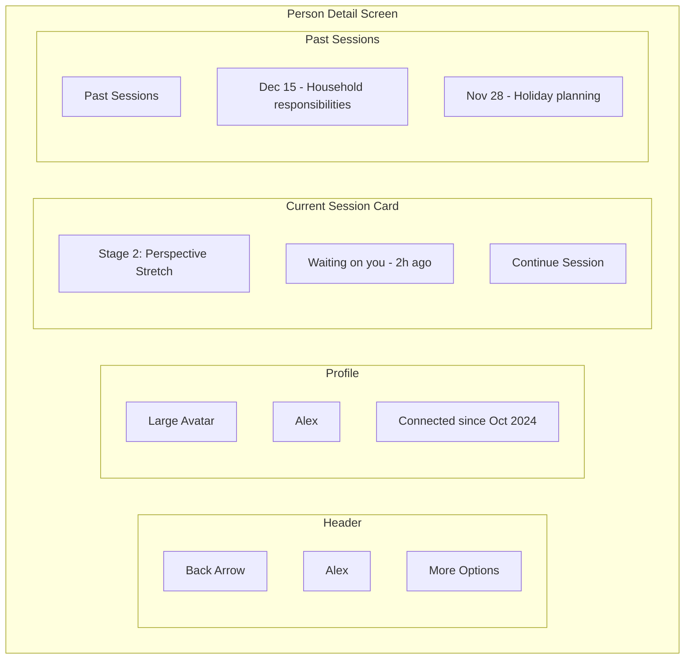
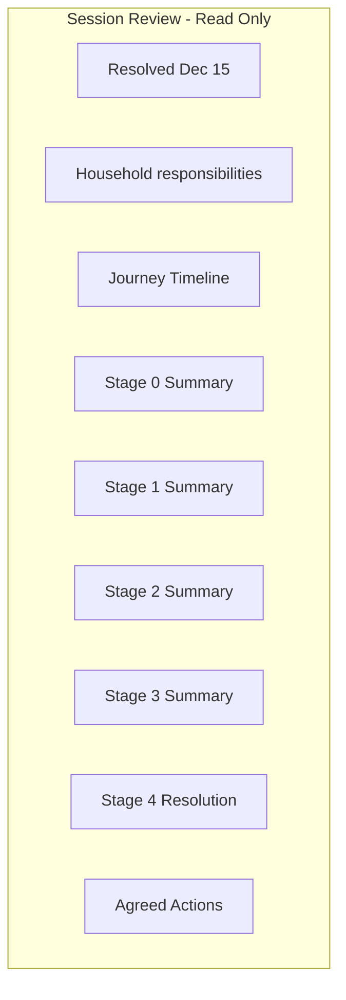
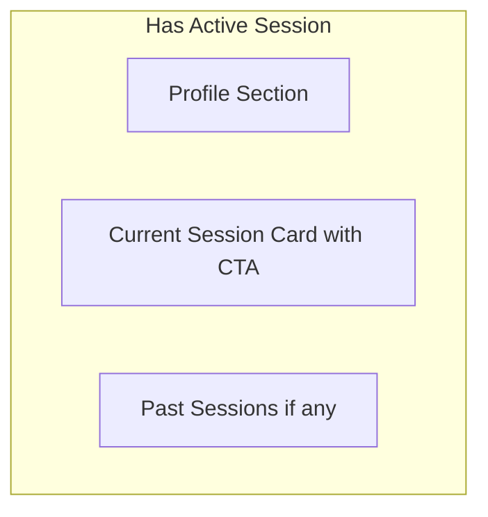
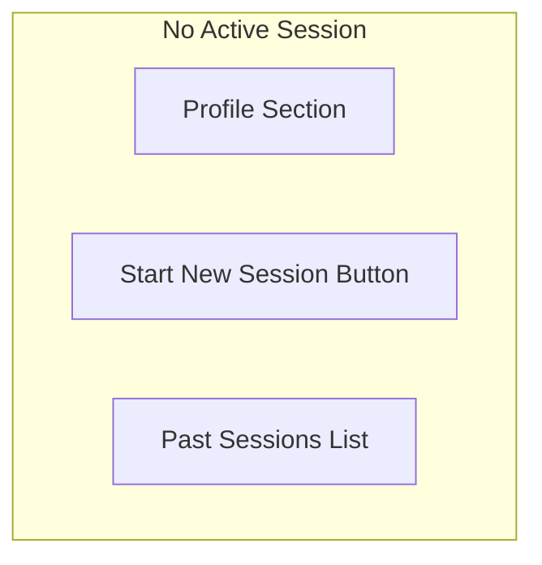
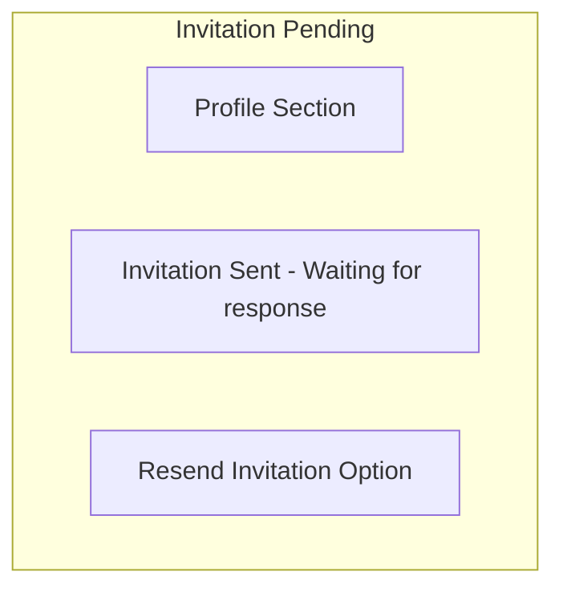
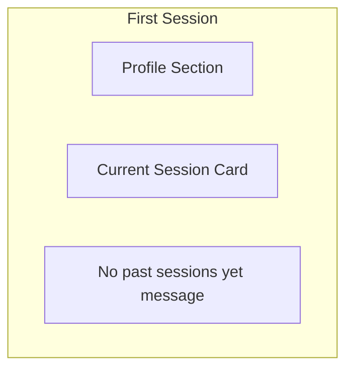

# Person Detail

The relationship view showing current session status and history with a specific person.

## Layout Structure

## Screen Layout

## Profile Section

| Element | Description |
|---------|-------------|
| Avatar | Large profile image or initials |
| Name | Person name prominently displayed |
| Connection | Connected since date in neutral language |

Uses neutral language - "Connected since Oct 2024" rather than "Partner since" to avoid relationship assumptions.

## Current Session Card

Shows when an active session exists with this person.

### Active Session Elements

| Element | Description |
|---------|-------------|
| Stage | Current stage name and number |
| Status | Who is waiting and for how long |
| CTA | Continue Session button |

### Status Variations

| State | Status Text |
|-------|-------------|
| Waiting on you | Waiting on you - 2h ago |
| Your turn | Ready to continue |
| Waiting on them | Waiting for Alex - 1d ago |
| Both in stage | Both working on Stage 3 |

### No Active Session

When no active session exists, show Start New Session button instead of current session card.

## Past Sessions List

Shows completed sessions in reverse chronological order.

### Past Session Card

| Element | Description |
|---------|-------------|
| Date | Resolution date |
| Topic | Brief topic from initial description |
| Status | Resolved indicator |

Tapping a past session opens a read-only review of the journey.

### Past Session Review

## States

### State 1: Active Session

### State 2: No Active Session

### State 3: Invited - Pending

### State 4: New Person - No History

## Actions

| Action | Result |
|--------|--------|
| Tap Back | Return to Home Dashboard |
| Tap Continue Session | Go to Session Dashboard |
| Tap Start New Session | Go to New Session flow |
| Tap Past Session | Open read-only review |
| Tap More Options | Show options menu |

## Options Menu

| Option | Description |
|--------|-------------|
| View Full History | See all sessions with this person |
| Remove Person | Remove from people list (if no active session) |

---

[Back to Wireframes](./index.md) | [Home Dashboard](./home-dashboard.md) | [Session Dashboard](./session-dashboard.md)
