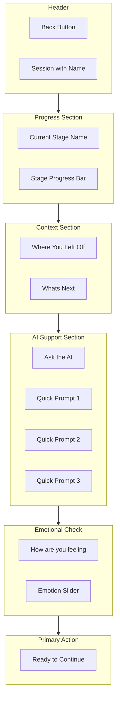
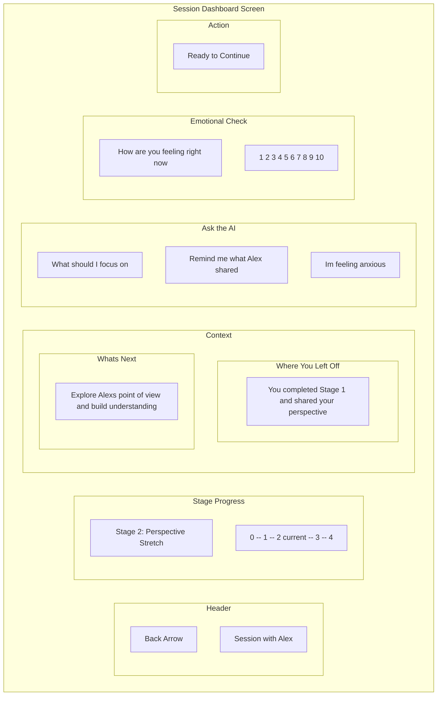
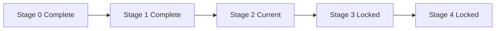
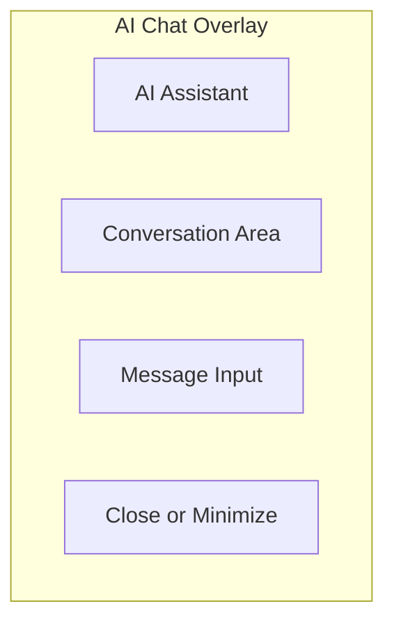
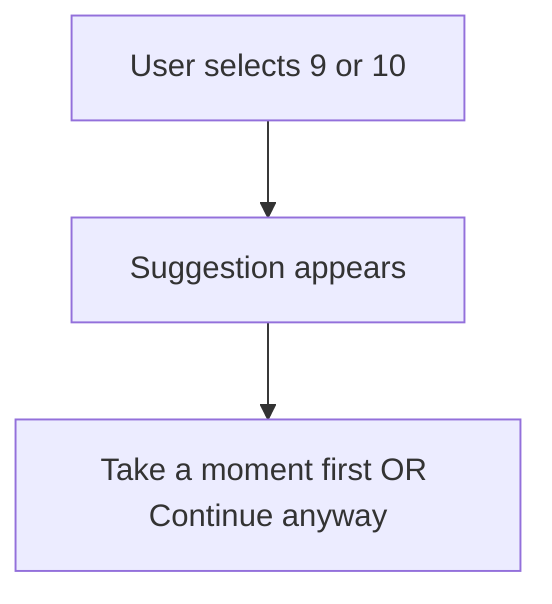
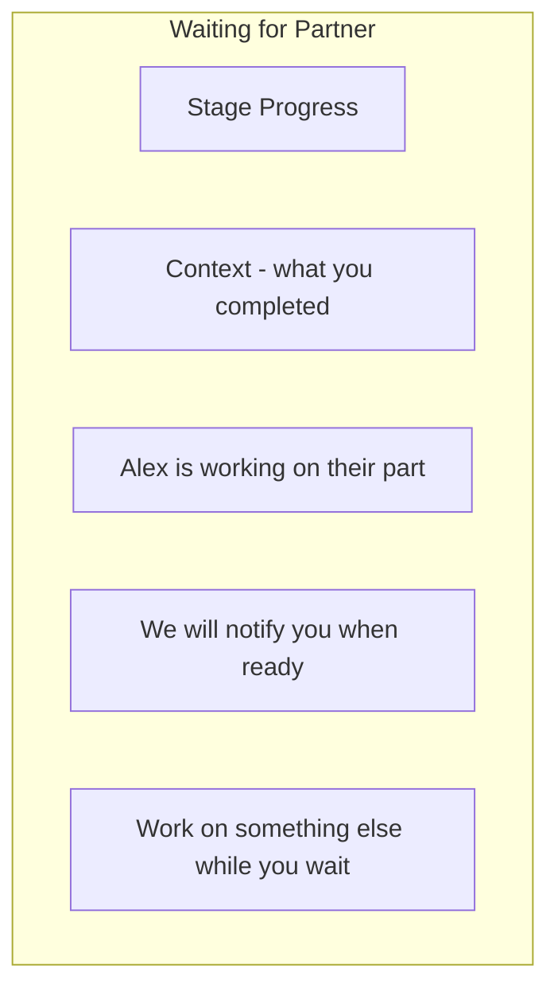

# Session Dashboard

The preparation space users see before entering stage work. Provides context, AI support, and emotional check-in.

## Purpose

After time away from a session, users need context before diving back in. The session dashboard:
- Reminds users where they left off
- Previews what comes next
- Offers AI support for questions or preparation
- Checks emotional readiness
- Creates intentional transition into the work

## Layout Structure

## Screen Layout

## Progress Section

### Stage Progress Bar

Visual representation of progress through all 5 stages.

| Stage State | Appearance |
|-------------|------------|
| Completed | Filled with checkmark |
| Current | Highlighted and labeled |
| Locked | Grayed out |

## Context Section

### Where You Left Off

Brief summary of what the user accomplished in their last interaction:
- "You completed Stage 1 and shared your perspective"
- "You and Alex both agreed to the Curiosity Compact"
- "You reflected on Alexs needs and found common ground"

### Whats Next

Preview of what the current stage involves:
- "Explore Alexs point of view and build understanding"
- "Together design a small experiment to try"
- "Share what you heard and confirm understanding"

Content adapts to current stage. See stage documentation for stage-specific messaging.

## AI Support Section

Quick prompts for common preparation needs. Tapping opens AI chat.

### Default Prompts

| Prompt | Purpose |
|--------|---------|
| What should I focus on | Stage-specific guidance |
| Remind me what was shared | Review previous content |
| Im feeling anxious | Emotional support and regulation |

### AI Chat Overlay

When a prompt is tapped, an AI chat opens as an overlay:

The AI can:
- Answer questions about the process
- Summarize what has been shared (respecting privacy vessels)
- Provide emotional regulation support
- Offer stage-specific guidance

## Emotional Check-in

### Emotion Slider

Simple 1-10 scale for current emotional intensity.

| Range | Meaning |
|-------|---------|
| 1-3 | Calm and ready |
| 4-6 | Some activation but manageable |
| 7-8 | Elevated - proceed with awareness |
| 9-10 | Consider cooling period first |

### High Emotion Response

If user selects 9-10:

Links to cooling period options if user wants support.

## Primary Action

### Ready to Continue Button

Large primary button that transitions into the stage work.

| State | Button |
|-------|--------|
| Ready | Ready to Continue - enabled |
| High emotion | Continue Anyway - secondary style |
| Waiting on partner | Waiting for Alex - disabled |

## Waiting States

When waiting for partner:

## Actions

| Action | Result |
|--------|--------|
| Tap Back | Return to Person Detail |
| Tap AI Prompt | Open AI chat overlay |
| Adjust Emotion Slider | Record current state |
| Tap Ready to Continue | Enter Stage View |

---

[Back to Wireframes](./index.md) | [Person Detail](./person-detail.md) | [New Session Flow](./new-session-flow.md)
